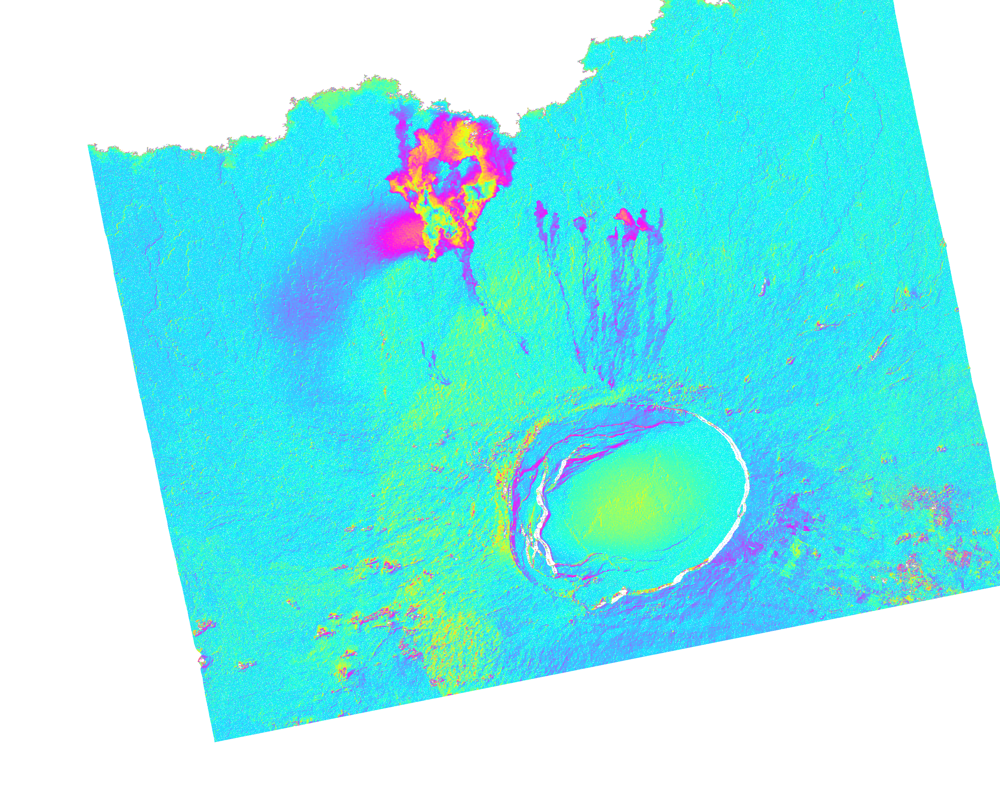

TanDEM-X bistatic interferogram processor (April 2017) for the NASA/Caltech JPL ISCE InSAR sofwtare. The files must be installed in the `isce2-2.6.4/contrib/stack/stripmapStack` folder.

The implementation follows technical advice provided by Piyush Agram (formerly at JPL). 

To process a bistatic interfeorgram run, create a text file called `tandemxApp.txt` with the following. 

```
alks 4
rlks 4
fs 0.1
tdx_date 20191025
bbox -0.92 -0.64 -91.35 -91.0
mask no
dem /Volumes/T7_Shield/sierra_negra/tandemx12m.dem
unwm icu

```
`20191025` is the name of the CoSSC directory that is usually distributed as a file that starts with `dims`. Change the DEM path to your prefered file and then run the software with

```
tandemxApp.csh tandemxApp.txt unpack geocode
```

The CoSSC processing is only partially implemented in the software. ISCE can process a bistatic interferogram up to the unwrapping step, but it does not have a module to accurately reconstruct the topography from the phase in slant range. Also, the bistatic geometry does not take into account in the range-Doppler equations for the geocoding. Neglecting these corrections is not very important if your topographic change is less than $\sim$50 m, but can produce very obvious errors in the elevation and the geocoding if you have large topographic changes ($>$ 150 m).





If you use this software, please cite the following papers

[Delgado, F., Kubanek, J., Anderson, K., Lundgren, P., Pritchard, M., 2019. Physicochemical models of rhyolitic eruptions constrained with InSAR and DEM data: a case study of the 2011-2012 Cordón Caulle eruption. Earth and Planetary Science Letters, 524, 115736, doi:10.1016/j.epsl.2019.115736](https://www.sciencedirect.com/science/article/abs/pii/S0012821X19304285)

[Galetto, F., Dualeh, E., Delgado, F., Pritchard, M., Poland, M., Ebmeier, S., Shreve, T., Biggs, J., Hamling, I., Wauthier, C., Gonzalez Santana, J., Froger, J.-L., Bemelmans, M., 2024. The utility of TerraSAR-X, TanDEM-X, and PAZ for studying global volcanic activity: Successes, challenges, and future prospects. Volcanica, 7(1), 273–301. doi: 10.30909/vol.07.01.273301.](https://www.jvolcanica.org/ojs/index.php/volcanica/article/view/245)
